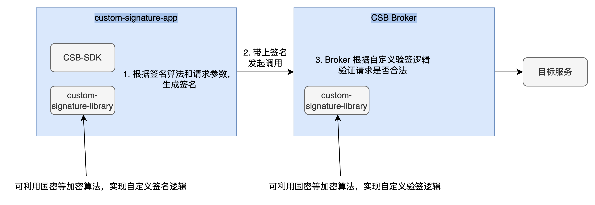
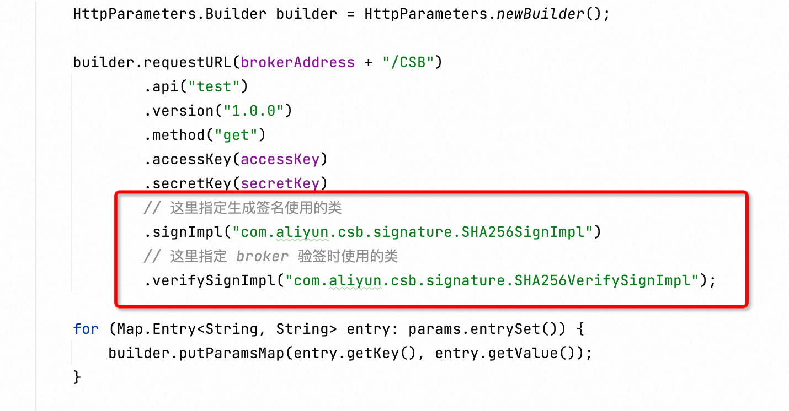

# custom-signature
CSB 1.0 自定义签名/验签 使用说明


自定义签名/验签整体示意图如上所示
* custom-signature-library: 自定义签名/验签的核心包，在本示例中，使用了 HSHA256 算法进行自定义签名/验签。如果需要使用其他算法，只需修改签名实现类和验签实现类的内部逻辑即可。
* custom-signature-app: 调用 Broker 的客户端应用，在本示例中用 Spring Boot 应用框架实现。应用中需要包含 CSB-SDK 的依赖，以及上面实现的自定义签名/验签包依赖

## 使用说明
下面给出自定义签名/验签功能的详细使用说明
### 1. 实现自定义签名/验签类
在 `custom-signature-library` 中，给出了利用 HSHA256 算法进行签名的示例，其中：
* `com.aliyun.csb.signature.SHA256SignImpl`: 实现了签名逻辑
* `com.aliyun.csb.signature.SHA256VerifySignImpl`: 实现了验签逻辑

用户可以参照该实现，实现任意的签名/验签逻辑。

### 2. 添加 META-INF/services/ 内文件内容
在实现完毕后，需要将实现类的全限定名添加进 `resources/META-INF/services/` 目录下，其中：
* 签名实现类需要添加至 `com.alibaba.csb.security.spi.SignService` 文件中
* 验签实现类需要添加至 `com.alibaba.csb.security.spi.VerifySignService` 文件中

### 3. 自定义逻辑打包
在 `custom-signature-libraray/` 目录下，执行
```
mvn clean package
```
将其打包为 jar 包，jar 包存放在了 `custom-signature-library/target` 目录中。
### 4. 客户端引入 Jar 包
在客户端应用中引入该 jar 包，例如可以通过 Maven 依赖的方式引入，也可以直接将该 jar 包放至 classpath 中，这取决于您客户端的使用方式。

例如，在本示例中，客户端应用为 Spring Boot 应用，使用了 Maven 的方式引入自定义签名/验签依赖。需要注意的是，此时还需要保证客户端应用的 ClassPath 中可以找到 `META-INF/services/com.alibaba.csb.security.spi.SignService` 文件，因此需要在 Spring Boot 应用的 `resources` 文件夹下添加上述文件，保证客户端应用可以使用 ServiceLoader 的机制来找到签名实现类（可以参考 `custom-signature-app` 项目）。

### 5. Broker 引入 Jar 包
为了使得 Broker 能够顺利验签，还需要将上述 jar 包添加至 CSB Broker 中，具体添加方式为：
1. 将上述 jar 包 添加至 Broker 所在的 Docker 容器中的 `/home/admin/cloud-gateway/patchlib/` 目录下
2. 执行重启脚本，重启 Broker

### 6. 客户端调用方式
上述步骤全部执行完毕后，客户端以及 Broker 的准备工作均执行完毕。

客户端在发起调用时，需要在原有 CSB-SDK 使用的基础上，添加 `signImpl` 和 `verifySignImpl` 两个参数，分别填写签名的实现类和验签的实现类，详情可参数 `custom-signature-app` 内的调用方式


## 异常情况
1. 如果在客户端发起调用时，指定的签名实现类无法找到，调用会报错，提示签名算法找不到，且请求不会发出。
2. 如果 Broekr 端在验签时，发现指定的验签实现类无法找到，会报错验签异常，并将错误回传给客户端，本次请求调用失败，不会转发至后端服务。